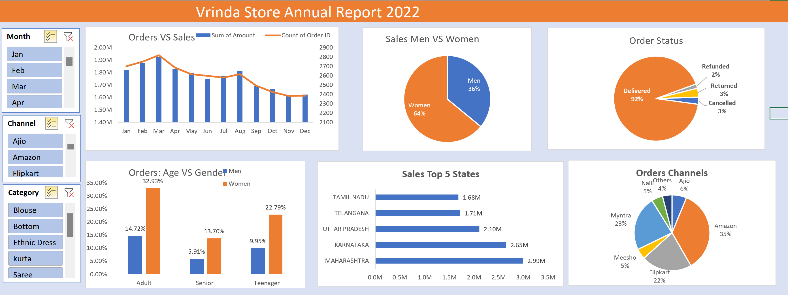

---

# 📊 Vrinda Store Annual Sales Report 2022 – Excel Dashboard

An interactive Excel dashboard built to analyze Vrinda Store's 2022 sales data. It visualizes key metrics like sales by state, gender, channels, order status, and product size—enabling deeper customer insights to drive 2023 growth.

---

## 📌 Purpose

This dashboard helps business owners and sales managers to:

* Understand who their top customers are (by age, gender, state)
* Identify peak sales months and best-selling product sizes
* Compare order volume and revenue trends
* Track performance across sales channels (Amazon, Flipkart, Myntra, etc.)
* Analyze customer behavior and buying patterns

---

## 🧰 Tech Stack

| Tool / Feature       | Usage                                                  |
|----------------------|--------------------------------------------------------|
| **Microsoft Excel**  | Data cleaning, analysis, and visualization             |
| **Pivot Tables**     | Summarizing and grouping data efficiently              |
| **Charts**           | Representing KPIs (Line, Bar, Pie, Column)             |
| **Formulas Used**    | `IF`, `VLOOKUP`, `TEXT`, `SWITCH`, `SUMIFS`            |
| **File Format**      | `.xlsx` (Excel Report), `.png` (Dashboard Preview)     |

---

## 📁 Data Source

This project uses a fictional dataset representing Vrinda Store's 2022 eCommerce transactions. The dataset contains:

- Customer demographics (gender and age group)
- Order amount and unique order IDs
- Product categories and sizes
- Order statuses (Delivered, Cancelled, Refunded, Returned)
- Sales channels (Amazon, Flipkart, Myntra, etc.)
- State-wise location details

---

### Business Problem

Vrinda Store needed a clear picture of their 2022 performance to improve targeting and promotions in 2023.

---

## 💡 Business Insights

- 👩‍🦰 **Women dominate orders** with 64% share.
- 👨‍👩‍👧‍👦 **Adults (30–49)** are the highest purchasing age group.
- 📦 **Delivery success** is excellent at 92%, with only minor cancellations/refunds.
- 🌍 **Top performing states**:
  - Maharashtra – ₹2.99M  
  - Karnataka – ₹2.65M  
  - Uttar Pradesh – ₹2.10M  
- 🛒 **Leading sales channels**:
  - Amazon – 35%
  - Myntra – 23%
  - Flipkart – 22%

---

## 📸 Screenshots

)

---
